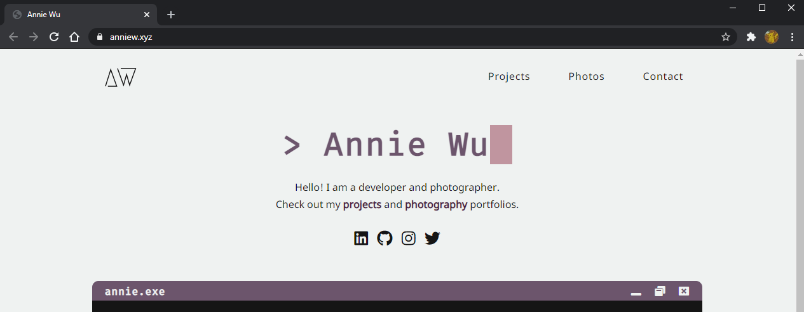

# [anniew.xyz](https://anniew.xyz/)

This is the source code for my personal website - a developer and photographer portfolio.

    
    
    

  

#### Tools Used
:blue_heart: [HTML5](https://developer.mozilla.org/en-US/docs/Web/Guide/HTML/HTML5)
:purple_heart: [CSS3](https://developer.mozilla.org/en-US/docs/Web/CSS)
:blue_heart: [Font Awesome](https://fontawesome.com/) for the icons
:purple_heart: [CSS-Tricks](https://css-tricks.com/snippets/css/typewriter-effect/) for the typewriter animation
:blue_heart: [Google Domains](https://domains.google/) for the cool domain
:purple_heart: [Netlify](https://www.netlify.com/) for hosting

---

### License

Copyright &copy; 2021 Annie Wu. All rights reserved.

--- 

If you like my content or find anything useful, please give it a star :star::blue_heart:.