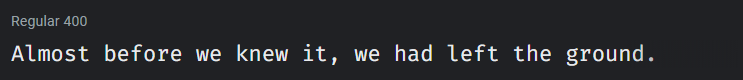
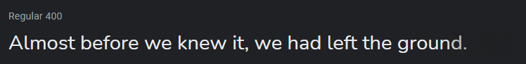
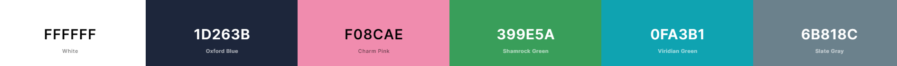

# [anniew.xyz](https://anniew.xyz/) - v2.5

This is the source code for my personal portfolio website.

    
    
    
    

  

## Table of Contents

- [Design](#design)
  - [Fonts](#fonts)
  - [Color Scheme](#color-scheme)
  - [Icon](#icon)
- [Built With](#built-with)
- [Creator](#creator)

---

## Design

### Fonts

[Fire Code](https://fonts.google.com/specimen/Fira+Code) - headings and code text

[Nunito](https://fonts.google.com/specimen/Nunito) - normal text

### Color Scheme

- White - all normal text color
- Oxford Blue - page background color, text color on white background
- Charm Pink - links, nav bar item hover, icon hover color
- Shamrock Green - Charm Pink links hover color
- Viridian Green - project skill text color
- Slate Gray - mobile navbar background color

---
## Built With

- 💙 [HTML5](https://www.w3schools.com/html/)
- 💜 [CSS3](https://www.w3schools.com/css/)
- 💙 [JavaScript](https://www.w3schools.com/js/DEFAULT.asp)
- 💜 [Flaticon](https://www.flaticon.com/) and [FontAwesome](https://fontawesome.com/v5.15/icons?d=gallery&p=1) for the icons
- 💙 [Google Domains](https://domains.google/) for the cool domain
- 💜 [Netlify](https://www.netlify.com/) for hosting
- 💙 [Figma](https://www.figma.com/) for design and prototyping tools

---
## Creator

Annie Wu ([anniedotexe](https://github.com/anniedotexe))

Copyright &copy; 2021-2026 Annie Wu. All rights reserved.

Unauthorized copying, reproduction, redistribution, or posting of this content or source code on any website, platform, or medium is strictly prohibited without explicit written permission from the author. Any use, modification, or distribution of this material without permission may violate copyright law.

If you like my content or find this code useful, give it a ⭐ or support me by buying me a coffee ☕💙

